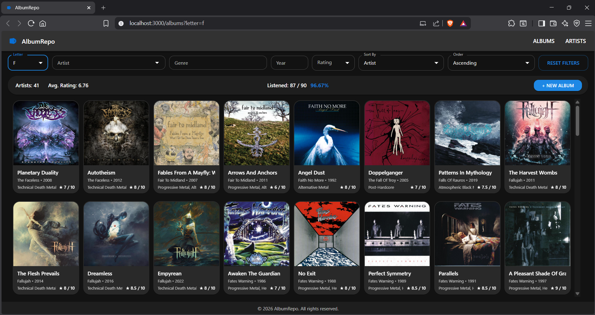
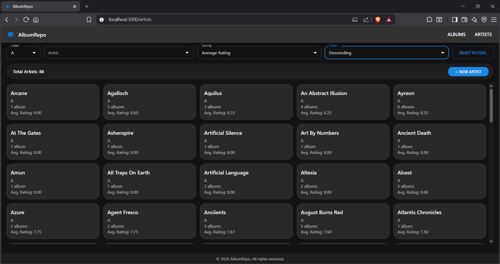
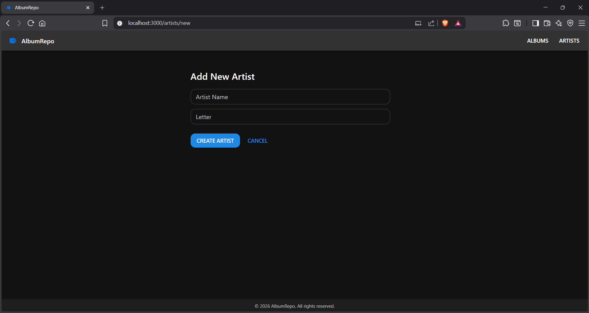
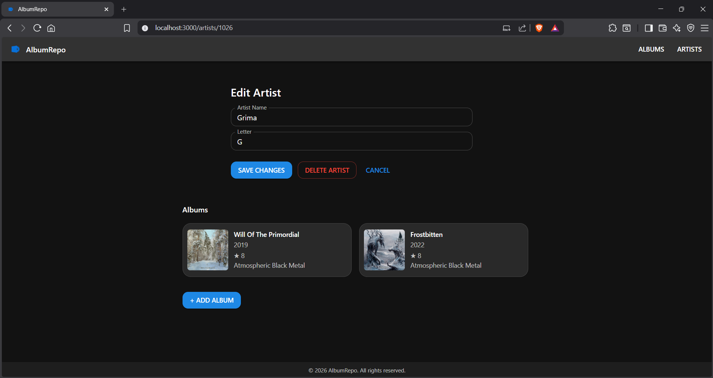
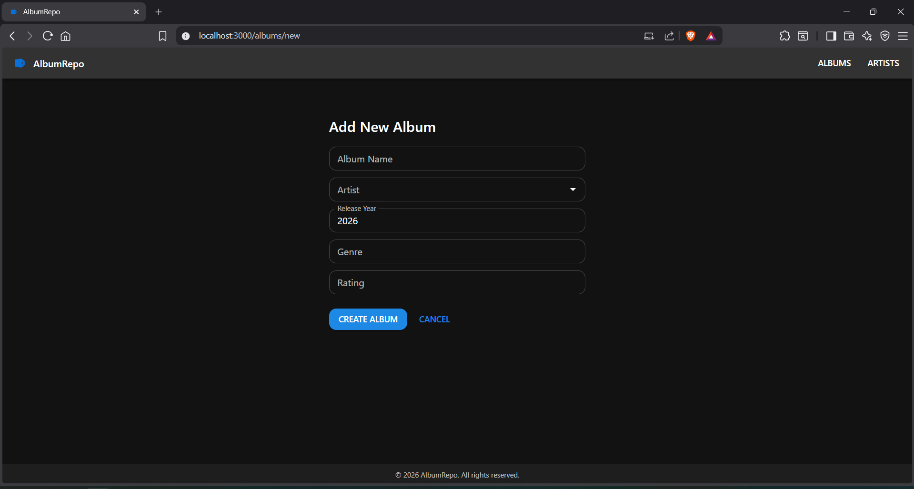
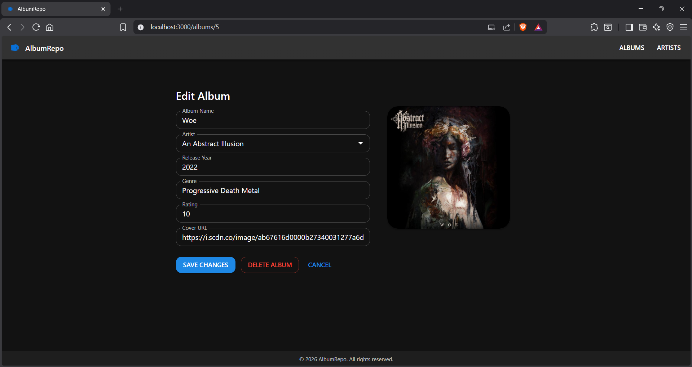

# AlbumRepo

## Overview
This is a web application for managing a personal album collection. 
Users can add, edit, delete, and view albums, including details such as artist, title, release year, and rating.
Note that this is configured as a single user application (not individual ratings for user accounts).

## Technologies Used
- **Frontend:** React
- **Backend:** Spring Boot
- **Database:** MySQL
- **Version Control:** Git

## Features
- Add new albums / artists
- Edit or delete existing albums / artists
- View albums / artists in a responsive, sortable table
- Filter and sort albums / artists
- Input validation to prevent incomplete or incorrect data

Screenshots:

